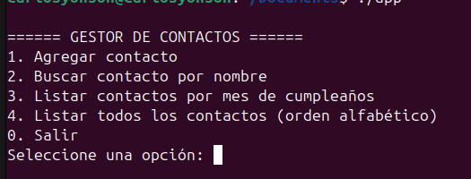
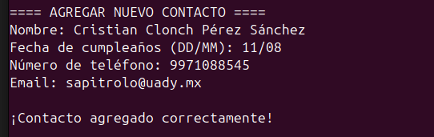
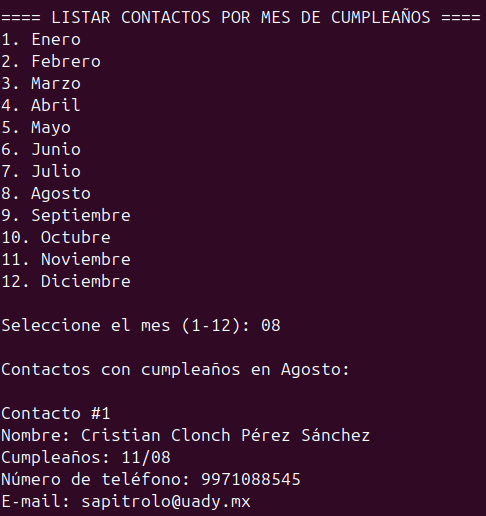

# 📇 Gestor de Contactos

Gestor de contactos desarrollado en Crystal que te permite guardar y organizar tu lista de contactos.

## 🧑🏿‍🏫 Integrantes del proyecto:
- Chan Torres Giuseph Alexis
- De Martino Ricci Cristian
- Manzanilla Martin Brian Eumir
- Zapata Chan Adrian Israel

## 💻 Acerca del lenguaje y ambiente de desarrollo

### Lenguaje Crystal

Este proyecto está implementado en [Crystal](https://crystal-lang.org/), un lenguaje de programación:

- **Compilado**: Crystal utiliza un compilador que traduce el código fuente a código máquina nativo, lo que le permite ser rápido en ejecución.
- **Tipado estático**: Detecta errores de tipo en tiempo de compilación, pero con inferencia de tipos que hace que no sea necesario declarar tipos explícitamente en muchos casos.
- **Sintaxis inspirada en Ruby**: Ofrece una sintaxis clara y elegante, similar a Ruby, pero con las ventajas de un lenguaje compilado.
- **Eficiente en memoria**: Usa menos memoria que lenguajes interpretados como Ruby o Python.

### Ambiente de desarrollo

Para escribir y ejecutar programas en Crystal:

1. **Editor**: Se puede usar cualquier editor de texto (VS Code, Sublime, Vim, etc.) con resaltado de sintaxis para Crystal.
2. **Terminal**: Se utiliza la línea de comandos para compilar y ejecutar el código.
3. **Compilador**: El comando `crystal build` compila el código fuente en un ejecutable binario.
4. **Gestor de dependencias**: Crystal usa `shards` para gestionar dependencias externas.

## ✨ Características

- 👤 **Añadir contactos** con nombre, fecha de cumpleaños, teléfono y correo electrónico
- 🔍 **Buscar contactos** por nombre
- 🎂 **Listar contactos** por mes de cumpleaños
- 📋 **Ver todos los contactos** ordenados alfabéticamente
- 💾 **Guardar automáticamente** los contactos en un archivo JSON

## 📥 Instalación

1. Asegúrate de tener [Crystal](https://crystal-lang.org/install/) instalado en tu sistema.
2. Clona este repositorio:
   ```bash
   git clone https://github.com/CarlosYonson/contact-list
   cd contact-list
   ```
3. Compila el proyecto:
   ```bash
   crystal build src/app.cr
   ```

## 🚀 Uso

Ejecuta el programa desde la línea de comandos:

```bash
./bin/contact-list
```

Sigue las instrucciones en la pantalla para:
1. Agregar nuevos contactos
2. Buscar contactos existentes
3. Ver contactos que cumplen años en un mes específico
4. Ver la lista completa de contactos

## 🏗️ Organización de la aplicación

El gestor de contactos sigue un enfoque modular con la siguiente organización:

### Arquitectura general

- **Modelo de datos**: Representado por las estructuras `Contact` y `ContactList`.
- **Interfaz de usuario**: Implementada con un menú de línea de comandos en `cli_menu.cr`.
- **Persistencia de datos**: Los contactos se guardan en formato JSON en un archivo.

### Componentes principales:

1. **Entrada/Punto de inicio**: `app.cr` inicia la aplicación llamando al menú principal.
2. **Lógica de negocios**: `contact-list.cr` maneja la lógica para manipular contactos.
3. **Interfaz de usuario**: `cli_menu.cr` gestiona la interacción con el usuario mediante un menú en consola.
4. **Modelo de datos**: `contact.cr` define la estructura de cada contacto.

## 📊 Estructuras de datos

El proyecto utiliza las siguientes estructuras para almacenar y manipular datos:

1. **Contact (Struct)**: Estructura que representa un contacto individual con:
   - `name`: String - Nombre del contacto
   - `birthday`: Time - Fecha de cumpleaños
   - `number_phone`: String - Número telefónico
   - `email`: String - Correo electrónico

2. **ContactList (Class)**: Clase que gestiona una colección de contactos con:
   - `contacts`: Array(Contact) - Lista de contactos
   - Métodos para añadir, buscar y listar contactos

3. **Persistencia**: Los contactos se serializan en formato JSON utilizando la biblioteca integrada `JSON::Serializable` para almacenamiento y recuperación.

## 📂 Estructura del proyecto

- `src/app.cr` - Punto de entrada del programa
- `src/contact.cr` - Definición de la estructura de un contacto
- `src/contact-list.cr` - Lógica para gestionar la lista de contactos
- `src/cli_menu.cr` - Interfaz de línea de comandos para interactuar con el usuario
- `contacts.json` - Archivo donde se guardan los contactos (se crea automáticamente)

## 🧑‍💻 Desarrollo

El proyecto está escrito en [Crystal](https://crystal-lang.org/), un lenguaje con sintaxis inspirada en Ruby pero con tipado estático y compilación a código nativo.

## 📸 Capturas de pantalla

### Menú principal

*Captura del menú principal de la aplicación*

### Añadir contacto

*Formulario para agregar un nuevo contacto*

### Listar contactos

*Listado de contactos en orden alfabético*

## Listar por mes de cumpleaños

*Listado de contactos que cumplen en el mismo mes*
## 📄 Licencia

Este proyecto está bajo la licencia MIT. Ver el archivo `LICENSE` para más detalles.
